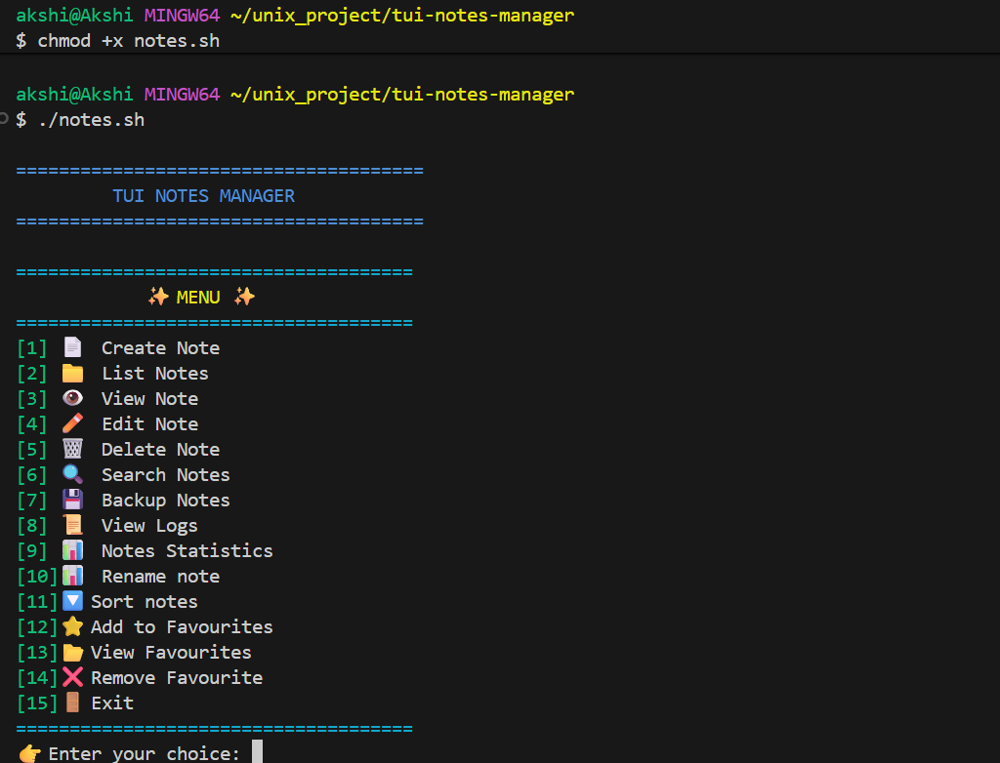

## TUI Notes Manager

A Terminal-based Notes Manager built in Bash for UNIX/Linux systems, providing a menu-driven interface to create, view, edit, search, and manage notes efficiently.

## project structure
tui-notes-manager/
│
├── data/
│   ├── notes/            # Folder where notes are stored
│   └── actions.log       # Log file recording all actions
│
├── docs/
│   └── README.md         # Project documentation
│
└── notes.sh              # Main bash script to run the TUI Notes Manager

## commands

# how to run 
1) open bash
2) move to dir where file notes.sh is 
cd  tui-notes-manager/
3) execute file notes.sh
chmod +x notes.sh
4) run file
./notes.sh

# how to work in vi editor
# commands used
i to insert text
press esc before exiting 
after esc to save and quit press :wq

